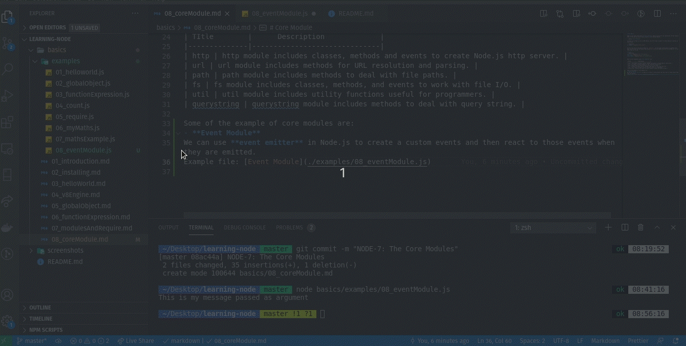
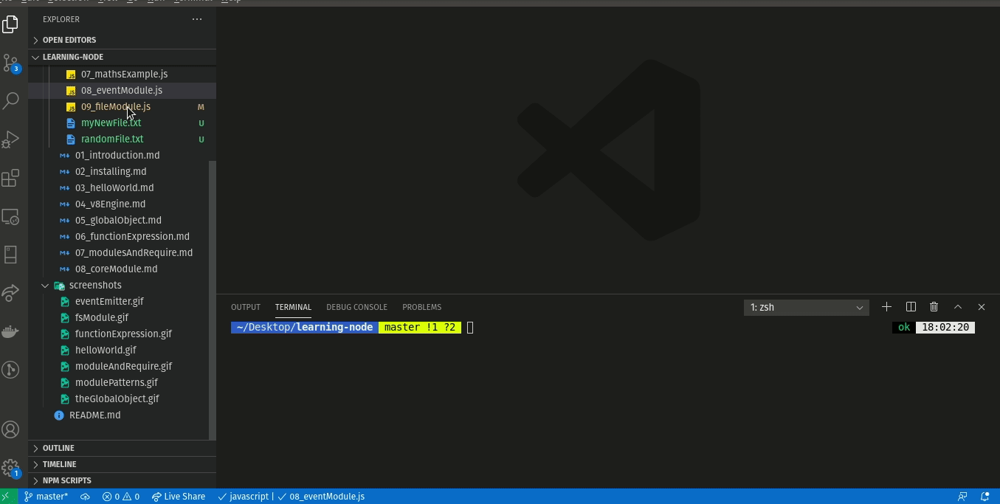

# Core Module

Node.js also ships with bunch of **core modules** which we can use in our application. We can require them in the same way that we would require a user defined modules.  

- Loading **Core Modules**  

In order to use Node.js core or NPM modules, you first need to import it using require() function as shown below.

```javascript
var module = require('module_name');
```

We will only pop in the name of module in `require()`, not the path to the module or anything like that. We will just use the module name because it is the core module built-in to the Node.js, it will fetch that on its own.  

**e.g:**
```javascript
const fs = require('fs'); //file module
const http = require('http'); //http module
const events = require('events'); //events module
```

Some of the frequently used **core modules** are: 

| TItle        |      Description             |
|--------------|------------------------------|
| http | http module includes classes, methods and events to create Node.js http server. |
| url | url module includes methods for URL resolution and parsing. |
| path | path module includes methods to deal with file paths. |
| fs | fs module includes classes, methods, and events to work with file I/O. |
| util | util module includes utility functions useful for programmers. |
| querystring | querystring module includes methods to deal with query string. |

Some of the example of core modules are: 
- **Event Module** 
We can use **event emitter** in Node.js to create a custom events and then react to those events when they are emitted.  



Example file: [Event Module](./examples/08_eventModule.js) 

- **FS Module**
The **fs module** enables interacting with the file system. All file system operations have synchronous, callback, and promise-based forms. 



Example file: [File Module](./examples/09_fileModule.js)
